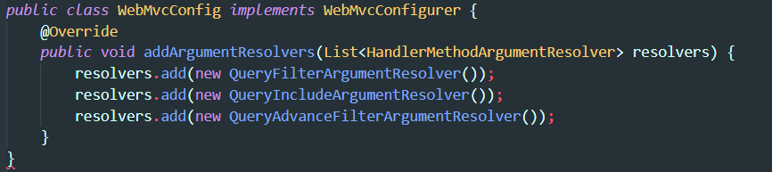

# api-query-data

API-QUERY-DATA cung cấp cơ chế để query dữ liệu từ database thông qua các api được cung cấp bởi BACKEND.

Cấu trúc project mẫu này được mình sử dụng trong một dự án thực tế. Trong quá trình làm mình đã tìm hiểu - vận dụng các kiến thức để đưa ra được một giải pháp truy vấn dữ liệu theo mình là cũng hữu ích trong nhiều dự án. Nên mình muốn chia sẻ với các bạn.

Giải pháp này gồm 3 phần:

- P1. Cấu trúc query string client sẽ sử dụng để truy vấn dữ liệu
- P2. Convert cấu trúc query string  về dạng Specification
- P3. Sử dụng Spring JPA Repository để lấy dự liệu

## P1 - trong phần này chúng ta sẽ có hai cách để truy vấn dữ liệu.

- Cách 1: sử dụng `query string` trong url để viết truy vấn. Sử dụng phương thức `GET`
- Cách 2: sử dụng `payload` của request để viết truy vấn. Sử dụng phương thức `POST`

Cách 1: 
> 
> GET /api/v1/user?filtersor=roles.name$eq$admin,roles.name$eq$cashier
> 
> OR
>
> GET /api/v1/user?filtersand=name$eq$phi

Cách 2:
>
> POST /api/v1/user/advance-search
>
> Payload
>
>       {
>           "filter": {
>               "$and": [
>                   {"name" : "phi"},
>                   {
>                       "$or": [
>                           {"roles.name" : "operator"},
>                           {"age" : { "$lt": 40}
>                       ]
>                   }
>               ]
>           }
>       }

Hai cách trên hỗ trợ các toán tử = (eq), like (like), not like (nlike), > (gt), < (lt), >= (ge), <= (le)

## P2. Convert cấu trúc query string về dạng Specification

### 1. Controller

Có hai phương thức để tạo xử lý query string ở P1.
Cho phương thức GET

        ResponseEntity<ResponseStatusDTO> getList(Pageable pageable, QueryFilter filter, QueryInclude includes,
            HttpServletRequest httpRequest);

Cho phương thức POST

        ResponseEntity<ResponseStatusDTO> advanceSearch(Pageable pageable, QueryAdvanceFilter filter,
            QueryInclude includes, HttpServletRequest httpRequest);

Để hai phương thức trên có thể hoạt động được, ta cần thêm `Argument Resolver như bên dưới`.

### 2. Services

`BaseService` sẽ cung cấp các method hỗ trợ query với cú pháp ở trên. Nên các service muốn sử dụng nên kế thừa `BaseService`.

        public interface BaseService<DTO, ENTITY, ID> {
            PageData<DTO> findAll(Pageable pageable, QueryFilter filter, String[] includes);
            PageData<DTO> findAll(Pageable pageable, QueryAdvanceFilter filter, String[] includes);
        }

Trong project này mình có `UserService` kế thừa `BaseService`

        public interface UserService extends BaseService<UserDTO, UserEntity, Integer> 
        {
        }

Về kỹ thuật để chuyển từ query string sang Specification thì trong BaseService ta chỉ cần câu lệnh bên dưới

        Specification specification = filter.createSpecification(getENTITYClazz());

## P3. Sử dụng Spring JPA Repository để lấy dự liệu
Gửi specification tạo được cho JPA Repository.

		Page<ENTITY> entitiesPage = baseRepository.findAll(specification, pageable);
